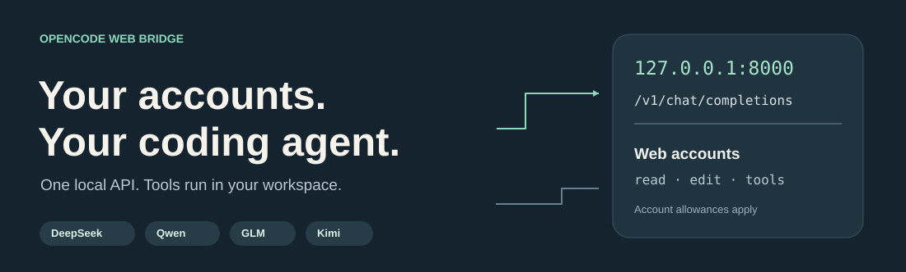
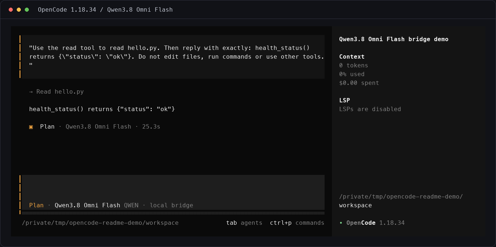
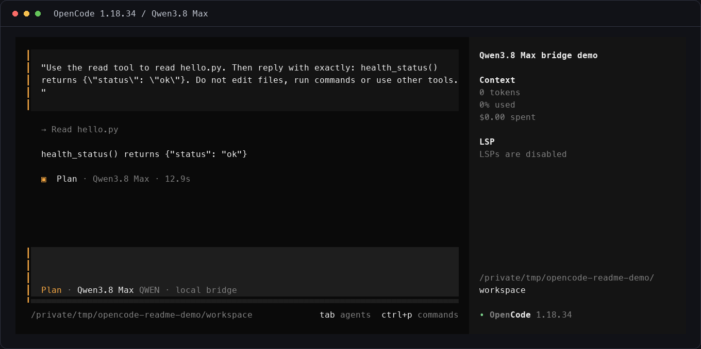
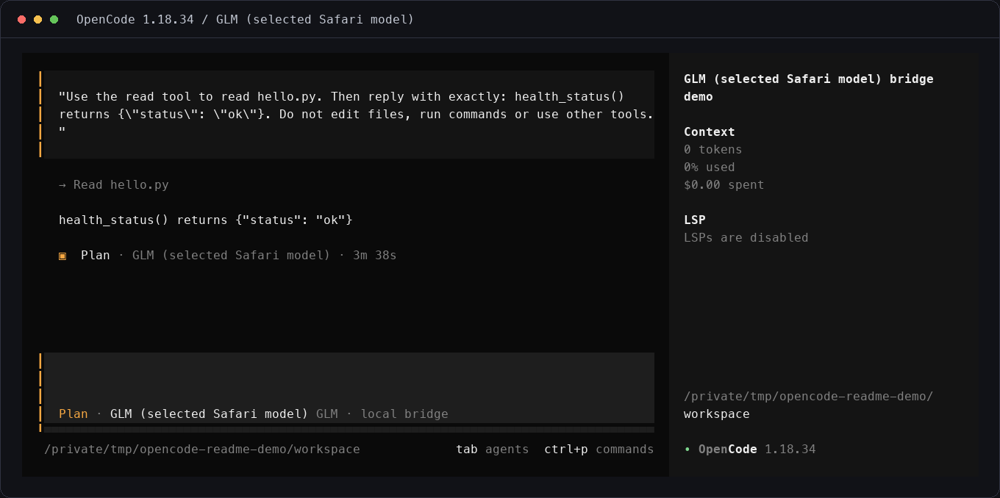
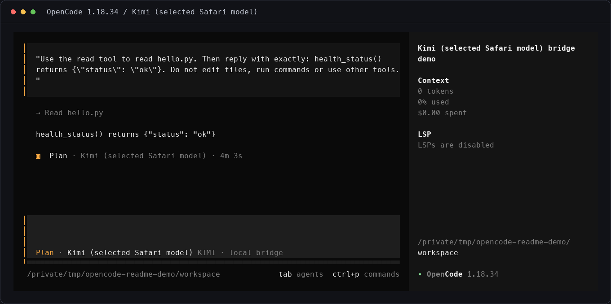
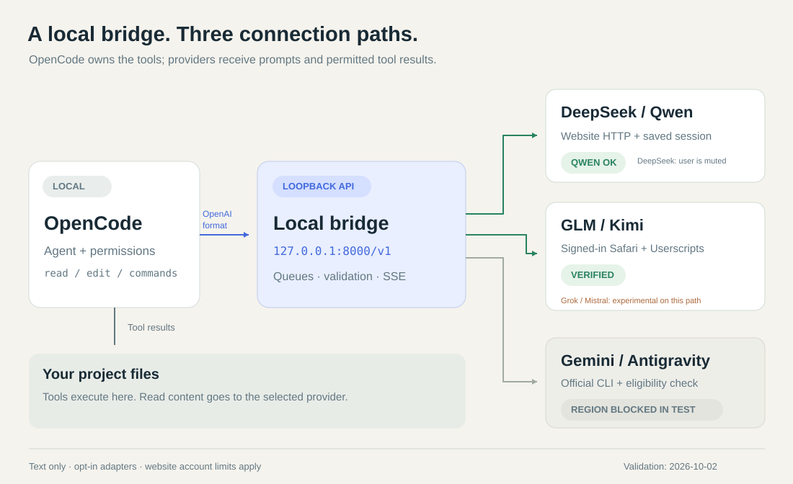

<p align="center">
  
</p>

<p align="center">
  <a href="README.en.md">English</a> ·
  <a href="#быстрый-старт">Начать</a> ·
  <a href="#что-работает">Провайдеры</a> ·
  <a href="#в-opencode">Демонстрации</a> ·
  <a href="docs/SETUP.ru.md">Полная инструкция</a>
</p>

# Ваши AI-аккаунты — в OpenCode

Локальный мост подключает веб-чаты **DeepSeek, Qwen, GLM и Kimi** к OpenCode
через OpenAI-совместимый API. Вы входите в свой аккаунт, выбираете модель и
работаете с файлами проекта в привычном агенте. Отдельный ключ API провайдера
для этих подключений не нужен.

**Экспериментальные адаптеры включаются отдельно. Перед запуском прочитайте
ограничения аккаунтов и настройки безопасного отказа ниже.**

[](https://github.com/Tsuev/opencode-deepseek/actions/workflows/tests.yml)

> Бесплатный веб-чат расходует **лимиты вашего аккаунта**. Это не безлимитный
> API: каждый ход агента, включая возврат результата инструмента, может
> потребовать нового сообщения. [Квоты и ограничения](#лимиты-и-границы).

> Автоматизация обычного веб-чата может привести к ограничению аккаунта.
> Наш аккаунт DeepSeek заблокирован до 4 октября 2026, 22:17 по сообщению сайта;
> точная причина не установлена. Сохранённые демонстрации относятся к версии
> до защитных исправлений; живую проверку на заблокированном аккаунте не повторяли.

Сервер больше не обновляет вход в фоне и не повторяет отказавшие запросы.
Блокировка, квота, защитный отказ или неопределённый результат сохраняют паузу
провайдера даже после перезапуска. Ответ — `403` с `retryable: false`; если SSE
уже начался, ошибка приходит событием, а следующая попытка получит `403` до
обращения к аккаунту. Между запросами и продолжениями — минимум 10 секунд
по умолчанию; это не гарантия соблюдения квот или правил сайта.

Посмотреть паузы: `python -m providers.access status`. Возобновлять конкретного
провайдера командой `python -m providers.access resume qwen` можно только после
ручной проверки обычного сайта. Вход сам по себе паузу не снимает.
В OpenCode задавайте `small_model` явно: генерация заголовков тоже расходует
сообщения и не должна незаметно обращаться к другому аккаунту.

## Что работает

Состояние на **2 октября 2026**. «Проверено» означает живой ответ, продолжение
диалога и выполнение `read` в OpenCode на контрольном файле. Это проверка
конкретного аккаунта и сессии, а не гарантия любой будущей задачи.

| Провайдер | Модели в локальном API | Состояние | Подключение |
| --- | --- | --- | --- |
| **DeepSeek** | `deepseek-chat` / `deepseek-expert` | Ранее проверено; текущий аккаунт получил `user is muted` | [Вход + сохранённая сессия](docs/SETUP.ru.md#4-вход-в-deepseek-один-раз) |
| **Qwen** | `qwen3.8-omni-flash` / `qwen3.8-max` | Flash и Max проверены | [Отдельная сессия Qwen](docs/SETUP.ru.md#qwen-chat) |
| **GLM / Z.ai** | `glm-web` | Проверено; в тесте GLM-5.3-Flash | [Ваша вкладка Safari](browser/README.md#safari) |
| **Kimi** | `kimi-web` | Проверено, включая инструменты | [Ваша вкладка Safari](browser/README.md#safari) |
| **Mistral / Vibe** | `mistral-web` | Один ответ прошёл; продолжение — `429`. Агент не проверен | Эксперимент, выключен по умолчанию |
| **Grok** | `grok-web` | Сайт отвечает; мост не захватывает завершённый ответ | Эксперимент, выключен по умолчанию |
| **Gemini** | Задаются из `agy models` | Вход прошёл; запрос отклонён по региону | [Официальный Antigravity CLI](browser/README.md#gemini), выключен |

У `glm-web` и `kimi-web` модель выбирается **на сайте**. Эти имена не обещают
версию или тариф. **Все провайдеры выключены после чистой установки**, включая
DeepSeek. Включайте только выбранное подключение.

## В OpenCode

Настоящие кадры OpenCode **1.18.34**: агент `plan` читает маленький `hello.py`
и возвращает его результат. Для демонстраций используется отдельная папка;
личных файлов и данных аккаунтов в кадрах нет.

| Qwen3.8 Omni Flash | Qwen3.8 Max |
| --- | --- |
|  |  |

| GLM · модель выбрана в Safari | Kimi · модель выбрана в Safari |
| --- | --- |
|  |  |

Нажмите на изображение, чтобы рассмотреть полный кадр.
[Как записаны демонстрации](docs/media/README.md). Свежая запись DeepSeek остановлена
отказом аккаунта `user is muted`; успешный кадр не подменяется старым. Для
Mistral, Grok и Gemini успешных демонстраций агента тоже пока нет.

## Быстрый старт

Понадобятся **Python 3.9+** (рекомендуем 3.12), Git, аккаунт Qwen и
[установленный OpenCode](https://opencode.ai/docs/). Сам мост не требует Node.js.
Ниже — первая установка на macOS/Linux; [Windows и подробности](docs/SETUP.ru.md).

**1. Установите мост из репозитория.**

```bash
git clone https://github.com/Tsuev/opencode-deepseek.git
cd opencode-deepseek
python3 -m venv venv
source venv/bin/activate
python -m pip install -r requirements.txt
python -m playwright install chromium
cp .env.example .env
```

**2. Войдите в Qwen и включите его.**

```bash
python -m qwen.auth
```

В `.env` замените `QWEN_ENABLED=0` на `QWEN_ENABLED=1`, затем:

```bash
python app.py
```

Вход выполните сами в открытом браузере. Сервер оставьте работающим.
Во втором терминале проверьте:

```bash
curl http://127.0.0.1:8000/healthz
curl http://127.0.0.1:8000/v1/models
```

**3. Подключите OpenCode в своём проекте.**

Возьмите [готовый `opencode.json`](examples/opencode.json) и поместите его
в папку проекта. Если конфиг уже есть, объедините объекты `provider`, сохранив
свои настройки. Порт по умолчанию — `8000`, `baseURL` —
`http://127.0.0.1:8000/v1`; `apiKey: "unused"` — заглушка для SDK.
Поля `limit` в примере задают консервативные бюджеты клиента; это не
спецификация контекста модели и не квота аккаунта.

```bash
cd /path/to/your-project
opencode --agent plan --model local-qwen/qwen3.8-omni-flash
```

Попросите прочитать файл и объяснить его. Переключиться к правкам можно штатным
выбором агента в OpenCode. [Настройка агентов и плагина инструментов](docs/SETUP.ru.md#интеграция-с-opencode).

**4. Добавьте нужные аккаунты.**

- **Qwen Max:** после входа Qwen выберите `local-qwen/qwen3.8-max`.
- **DeepSeek (риск ограничения аккаунта):** включите `DEEPSEEK_ENABLED=1`
  в `.env` только осознанно, выполните `python -m deepseek.auth`, перезапустите
  сервер и выберите `local-deepseek/deepseek-chat`
  или `local-deepseek/deepseek-expert`. При отказе `user is muted` остановитесь:
  повторный вход в нашем тесте его не устранил.
- **GLM / Kimi:** установите Safari Userscripts и выполните
  [подключение вкладки](browser/README.md#safari). В `.env` включите
  `BROWSER_BRIDGE_ENABLED=1` и `GLM_ENABLED=1` / `KIMI_ENABLED=1`, перезапустите
  сервер. Модели OpenCode — `local-glm/glm-web` / `local-kimi/kimi-web`.
  Держите связанную вкладку открытой; закрытие или перезагрузка во время
  запроса прерывает задачу.

Не включайте экспериментальные адаптеры только потому, что они есть в коде.
Сначала проверьте их текущий статус в таблице.

## Как устроен мост



[Открыть схему целиком](docs/media/bridge-architecture.svg).

**OpenCode выполняет инструменты на вашем компьютере.** Модель получает
текст запроса и результаты разрешённых инструментов. Мост преобразует
завершённый ответ в текст или проверенный `tool_calls`; незавершённые и
некорректные вызовы не выдаются клиенту.

**Подключения устроены по-разному.** DeepSeek и Qwen используют сохранённые
локально сессии и HTTP-протокол веб-чата. GLM и Kimi отправляют сообщения через
обычную вкладку Safari: Userscripts связывают её с локальной очередью. Вход
остаётся в браузере. Gemini использует отдельный официальный CLI.

Для браузерных адаптеров текст сначала проверяется на принадлежность запросу
и завершение потока. SSE может передавать keepalive, пока готовится проверенный
ответ; это не обещание посимвольного потока от любого провайдера.

## Лимиты и границы

- **Mistral Free ограничивает сообщения.** В нашей проверке квота остановила
  продолжение после первого успешного ответа. [Тарифы Mistral](https://mistral.ai/pricing/).
- **У Kimi есть ограничения частоты и нагрузки.** Китайский провайдер тоже не
  означает безлимит. [Официальная справка](https://www.kimi.com/en/help/others/chat-issues).
- **У DeepSeek, Qwen и GLM квота в наших тестах не исчерпалась.** Фиксированный
  текущий лимит веб-чата мы не установили. Квоты платного API и CLI к этим
  подключениям не относятся.
- **DeepSeek сейчас отклонил наш аккаунт:** `biz_code=5`, `user is muted`.
  Причина в ответе не указана. Это результат текущей проверки аккаунта,
  а не доказательство общего запрета для всех пользователей.
- **Сейчас поддерживается текст.** Изображения, аудио и видео мост не загружает,
  даже если в названии модели есть Omni.
- **Веб-протоколы могут меняться.** `429`, защитная проверка и региональный отказ
  — повод остановиться и проверить обычный интерфейс аккаунта.

[Полное описание ограничений](browser/README.md#usage-limits).
Мост не переключает аккаунты для обхода квот и не предоставляет региональный доступ.

## Что остаётся локально

API по умолчанию слушает **`127.0.0.1`**. Сохранённые сессии находятся в
`session/`, настройки — в `.env`; эти файлы исключены из Git. Персональные
Userscripts содержат ключ связи с вашим мостом — не публикуйте их.

Запросы и прочитанные агентом данные отправляются **выбранному провайдеру**.
Локальный мост не делает облачную модель локальной. Доступ агента к файлам и
командам регулируется разрешениями OpenCode.

[Подробности безопасности](docs/SETUP.ru.md#безопасность).

## Документация и разработка

- [Полная настройка, API, troubleshooting](docs/SETUP.ru.md)
- [Safari, GLM/Kimi, экспериментальные адаптеры и Gemini](browser/README.md)
- [Конфиг OpenCode для проверенных подключений](examples/opencode.json)
- [Примеры Python и HTTP](examples/README.md)
- [Отдельный чат DeepSeek в терминале](docs/TERMINAL_CHAT.md)

CI проверяет Python 3.9 и 3.12, загрузку PoW WASM, синтаксис shell/JavaScript
и изолированные браузерные сценарии. [Запуски CI](https://github.com/Tsuev/opencode-deepseek/actions/workflows/tests.yml).
Для локальной проверки: `python -m unittest discover -s tests -t . -v`.

**MIT · неофициальный проект.** Основан на
[Tsuev/opencode-deepseek](https://github.com/Tsuev/opencode-deepseek) и
[sums001/Deepseek-API](https://github.com/sums001/Deepseek-API).
Используйте свой аккаунт в рамках условий соответствующего сервиса.
[Лицензия](LICENSE).
